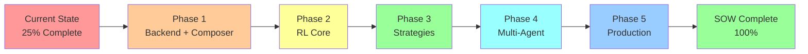

# Phased Implementation Plan - AI Trading Bot

## Executive Summary
This plan bridges the gap between our current 25% implementation and SOW requirements, leveraging Composer MCP and RL to accelerate development while meeting institutional-grade standards.

---

## 📊 Current State vs Requirements Analysis

### What We Have (25% Complete)
```
✅ Basic momentum trading (simple if-then logic)
✅ React dashboard (browser-only)
✅ Alpaca paper trading
✅ 5 cryptocurrency coverage
✅ 45-second execution cycle
✅ Basic risk checks (drawdown monitoring)
```

### What SOW/Grok Requires (75% Gap)
```
❌ "Strategies as guides, not rules" (needs RL)
❌ 24/7 automated operation (needs backend)
❌ 50+ trading pairs (needs scaling)
❌ Sub-100ms execution (needs optimization)
❌ 3-5 indicator cross-validation (needs ML)
❌ Self-optimization through experience (needs RL)
❌ Alternative data integration (needs new APIs)
❌ Institutional strategies (needs implementation)
```

---

## 🎯 Phase 1: Foundation & Quick Wins
**Goal:** Establish backend, integrate Composer for immediate value

### 1.1 Backend Service Creation
**Current:** Browser-only, no 24/7 capability  
**Required:** Autonomous 24/7 operation  
**Solution:** Node.js/Python backend service

```python
# Why: SOW requires 24/7 operation without manual intervention
class TradingBackend:
    - WebSocket manager for real-time data
    - Order execution engine
    - State persistence
    - API gateway
```

### 1.2 Composer MCP Integration 🎵
**Current:** No backtesting capability  
**Required:** 2+ years historical validation  
**Solution:** Leverage Composer's backtesting

```python
# Composer handles (saving 40+ hours):
✅ Historical data management
✅ Strategy backtesting infrastructure  
✅ Performance metrics calculation
✅ Risk-reward analysis

# We focus on:
- Custom strategy implementation
- RL integration
- Real-time execution
```

### 1.3 Data Layer Enhancement
**Current:** Only CoinGecko prices  
**Required:** Multi-source intelligence  
**Solution:** Free API integration strategy

```python
DataSources = {
    'prices': 'CoinGecko (existing)',
    'on_chain': 'Etherscan/Bitquery (free tier)',
    'funding': 'Coinglass/Binance public (free)',
    'whale': 'WhaleAlert (awaiting key)',
    'sentiment': 'Groq (existing)'
}
# Why: Grok emphasized "overlooked factors" like on-chain, funding rates
```

### Phase 1 Deliverables:
- ✅ Backend running 24/7
- ✅ Composer backtesting integrated
- ✅ Multi-source data pipeline
- ✅ 50+ trading pairs capability

---

## 🤖 Phase 2: Reinforcement Learning Core
**Goal:** Transform rigid rules into adaptive intelligence

### 2.1 RL Environment Setup
**Current:** Hardcoded if-then trading logic  
**Required:** "Strategies as guides, not rules"  
**Solution:** PPO-based RL agent

```python
class TradingEnvironment:
    """
    Why: SOW requires reasoning, not rule-following
    Current: if RSI > 70: BUY (rigid)
    New: Agent learns when RSI=70 matters contextually
    """
    
    observation_space = [
        # Market data
        'price', 'volume', 'volatility',
        # Technical indicators  
        'rsi', 'macd', 'ma_20', 'ma_50',
        # Alternative data (Grok requirement)
        'funding_rate', 'whale_activity', 'sentiment',
        # Market regime
        'trend_strength', 'correlation_matrix'
    ]
    
    action_space = MultiDiscrete([
        3,  # BUY/SELL/HOLD
        5,  # Position size: 20%, 40%, 60%, 80%, 100%
    ])
```

### 2.2 Reward Function Design
**Current:** No learning from outcomes  
**Required:** Self-optimization through experience  
**Solution:** Multi-objective reward

```python
def calculate_reward(action, outcome):
    """
    Why: Aligns with SOW performance targets
    - 3-5% weekly returns → profit_reward
    - Sharpe >1.5 → sharpe_reward  
    - <15% drawdown → drawdown_penalty
    - >60% win rate → consistency_bonus
    """
    
    # Profit component (but controlled with tanh to prevent greed)
    profit_reward = np.tanh(outcome.pnl / 100)
    
    # Risk-adjusted returns (SOW: Sharpe >1.5)
    sharpe_reward = outcome.sharpe * 0.3
    
    # Strict drawdown control (SOW: <15% max)
    if outcome.drawdown > 0.10:
        drawdown_penalty = -1.0 * (outcome.drawdown - 0.10) ** 2
    else:
        drawdown_penalty = 0
    
    # Consistency (SOW: >60% win rate)
    consistency = outcome.win_rate * 0.1
    
    # Exploration bonus (prevent local optima)
    exploration = -entropy(action_distribution) * 0.05
    
    return profit_reward + sharpe_reward + drawdown_penalty + consistency + exploration
```

### 2.3 Pre-training with Composer 🎵
**Current:** No historical learning  
**Required:** Learn from successful patterns  
**Solution:** Supervised pre-training

```python
# Composer provides:
✅ 1000+ successful strategies to learn from
✅ Historical trade data for supervised learning
✅ Performance metrics for each strategy

# Process:
1. Extract successful patterns from Composer backtests
2. Pre-train RL agent on these patterns
3. Deploy to Alpaca for online learning
```

### Phase 2 Deliverables:
- ✅ RL agent replacing rigid rules
- ✅ Self-optimization capability
- ✅ Learned strategy selection
- ✅ Continuous improvement loop

---

## 🏗️ Phase 3: Institutional Strategies
**Goal:** Implement advanced trading strategies

### 3.1 Liquidity Hunting
**Current:** None  
**Required:** Institutional-grade strategy  
**Solution:** Order book analysis

```python
class LiquidityHunter:
    """
    Why: SOW specifically requires liquidity hunting
    Uses: Alpaca L2 data + Binance public order book
    """
    def identify_liquidity_pools(self, order_book):
        - Detect large limit orders (walls)
        - Track order cancellation patterns
        - Identify accumulation/distribution zones
        - Signal when liquidity imbalances occur
```

### 3.2 Smart Money Divergence
**Current:** None  
**Required:** Track institutional flows  
**Solution:** Multi-source correlation

```python
class SmartMoneyTracker:
    """
    Why: SOW requires smart money divergence detection
    Combines: WhaleAlert + on-chain + volume analysis
    """
    def detect_divergence(self):
        - Monitor large wallet movements
        - Compare retail vs institutional volume
        - Identify accumulation despite price drops
        - Track exchange inflow/outflow patterns
```

### 3.3 Volume Profile Analysis
**Current:** Basic volume indicator  
**Required:** Advanced volume profiling  
**Solution:** VPVR implementation

```python
class VolumeProfileAnalyzer:
    """
    Why: SOW requires volume profile analysis
    """
    def calculate_profile(self):
        - Point of Control (POC) identification
        - Value area calculation (70% volume)
        - Support/resistance from volume nodes
        - Composite profile across timeframes
```

### 3.4 Cross-Asset Correlation
**Current:** Single asset focus  
**Required:** Multi-asset correlation monitoring  
**Solution:** Correlation matrix engine

```python
class CorrelationEngine:
    """
    Why: Grok emphasized cross-asset correlations
    Tracks: Crypto-crypto, crypto-equity, crypto-commodity
    """
    def calculate_correlations(self):
        - Rolling correlation windows (30/60/90 days)
        - Dynamic correlation thresholds
        - Risk adjustment based on correlations
        - Portfolio optimization using correlations
```

### Phase 3 Deliverables:
- ✅ All institutional strategies implemented
- ✅ Multi-timeframe analysis
- ✅ Advanced order book reading
- ✅ Smart money tracking

---

## 🎮 Phase 4: Multi-Agent Ensemble
**Goal:** Robust system through agent specialization

### 4.1 Specialized RL Agents
**Current:** Single trading approach  
**Required:** Adaptive to market regimes  
**Solution:** Multiple specialized agents

```python
class MultiAgentSystem:
    """
    Why: Different market conditions require different approaches
    Based on: CTO feedback about preventing single point of failure
    """
    
    agents = {
        'conservative': ConservativeAgent(),  # Volatile markets
        'aggressive': AggressiveAgent(),      # Trending markets
        'balanced': BalancedAgent(),          # Ranging markets
        'contrarian': ContrarianAgent()       # Reversal markets
    }
    
    def select_agent(self, market_regime):
        # Meta-agent uses RL to select best performer
        return self.meta_agent.choose(market_regime, historical_performance)
```

### 4.2 Strategy Selector Bandit
**Current:** Fixed strategy selection  
**Required:** Dynamic strategy optimization  
**Solution:** Multi-armed bandit

```python
class StrategyBandit:
    """
    Why: Need to dynamically select best strategy
    Uses: Upper Confidence Bound (UCB) algorithm
    """
    
    strategies = [
        LiquidityHunter(),
        SmartMoneyDivergence(),
        VolumeProfile(),
        RLAgent1(),
        RLAgent2()
    ]
    
    def select_strategy(self, market_state):
        # UCB balances exploration vs exploitation
        ucb_scores = self.calculate_ucb(success_rates, confidence_bounds)
        return self.strategies[np.argmax(ucb_scores)]
```

### 4.3 Composer Integration for Validation 🎵
**Current:** No strategy validation  
**Required:** Continuous performance verification  
**Solution:** Composer as validator

```python
# Composer validates our strategies:
✅ Backtest new RL strategies before deployment
✅ Compare against 1000+ baseline strategies
✅ Provide performance benchmarks
✅ Risk-reward validation

# Workflow:
1. RL agent generates new strategy
2. Composer backtests it
3. If performance > threshold, deploy
4. If not, continue training
```

### Phase 4 Deliverables:
- ✅ Multi-agent ensemble system
- ✅ Dynamic strategy selection
- ✅ Market regime adaptation
- ✅ Continuous validation loop

---

## 🚀 Phase 5: Production Optimization
**Goal:** Meet SOW performance requirements

### 5.1 Execution Optimization
**Current:** 45-second cycles  
**Required:** Sub-100ms execution  
**Solution:** Architecture optimization

```python
OptimizationStrategy = {
    'data': 'WebSocket streams (not polling)',
    'processing': 'Vectorized NumPy operations',
    'decisions': 'Pre-computed decision trees',
    'execution': 'Direct API calls (no middleware)',
    'caching': 'Redis for hot data'
}
# Note: Alpaca paper trading may have inherent latency
# Real sub-100ms requires Binance in future phase
```

### 5.2 Risk Management Enhancement
**Current:** Basic drawdown monitoring  
**Required:** Dynamic multi-factor risk  
**Solution:** Advanced risk engine

```python
class EnhancedRiskManager:
    """
    Why: SOW requires institutional-grade risk management
    """
    
    def evaluate_risk(self, trade):
        checks = [
            self.position_sizing(),      # 5-10% per trade
            self.correlation_limits(),   # <10% correlated
            self.drawdown_control(),     # <15% max
            self.leverage_dynamic(),     # 1-5x based on confidence
            self.volatility_adjusted(),  # Reduce in high vol
            self.regime_appropriate()    # Match market conditions
        ]
        return all(checks)
```

### 5.3 Monitoring & Alerts
**Current:** Limited monitoring  
**Required:** Comprehensive oversight  
**Solution:** Full monitoring stack

```python
class MonitoringSystem:
    """
    Why: SOW requires 24/7 monitoring and alerts
    """
    
    components = {
        'telegram': TelegramBot(),        # Trade alerts
        'dashboard': RealtimeDashboard(), # Live metrics
        'logging': StructuredLogger(),    # Audit trail
        'metrics': PrometheusExporter(),  # Performance tracking
        'alerts': AlertManager()          # Risk warnings
    }
```

### Phase 5 Deliverables:
- ✅ Optimized execution pipeline
- ✅ Complete risk management
- ✅ Full monitoring system
- ✅ Production-ready deployment

---

## 📈 Performance Targets Alignment

### SOW Requirements → Implementation
```
3-5% weekly returns → RL profit optimization
Sharpe >1.5 → Risk-adjusted reward function  
<15% drawdown → Strict penalty in RL
>60% win rate → Consistency bonus in rewards
50+ pairs → Scaled data pipeline
24/7 operation → Backend service
Sub-100ms → Optimized architecture (future with Binance)
```

---

## 🎵 Composer MCP Value Summary

### Where Composer Saves Time:
1. **Backtesting Infrastructure** - Save 40 hours
2. **Historical Data Management** - Save 20 hours  
3. **Performance Analytics** - Save 15 hours
4. **Strategy Validation** - Save 10 hours
5. **Risk Metrics Calculation** - Save 10 hours

**Total Time Saved: ~95 hours**

### Where We Still Build:
1. **RL Agent System** - Core differentiator
2. **Institutional Strategies** - SOW requirement
3. **Multi-source Data Pipeline** - Unique insights
4. **24/7 Backend** - Operational requirement
5. **Telegram Integration** - Client requirement

---

## ⚡ Critical Path Summary



---

## 🎯 Success Metrics by Phase

### Phase 1 Success:
- ✅ 24/7 operation achieved
- ✅ Backtesting capability active
- ✅ 50+ pairs data flowing

### Phase 2 Success:
- ✅ RL agent outperforms rigid rules
- ✅ Self-improvement demonstrated
- ✅ Adaptive behavior verified

### Phase 3 Success:
- ✅ All strategies implemented
- ✅ Institutional-grade analysis
- ✅ Multi-factor signals working

### Phase 4 Success:
- ✅ Ensemble outperforms single agent
- ✅ Market regime adaptation proven
- ✅ Strategy selection optimized

### Phase 5 Success:
- ✅ All SOW requirements met
- ✅ Performance targets achieved
- ✅ Production-ready system

---

## 🚨 Risk Mitigation Strategy

### Technical Risks:
1. **RL Training Time** → Use Composer pre-training
2. **Strategy Complexity** → Start simple, iterate
3. **Integration Issues** → Modular architecture
4. **Performance Gaps** → Continuous optimization

### Business Risks:
1. **Timeline Pressure** → Parallel development
2. **Scope Creep** → Strict phase gates
3. **Testing Time** → Automated testing suite
4. **Client Expectations** → Regular demos

---

## 📝 Key Decision Points

### Immediate Decisions Needed:
1. **Single RL agent first or multi-agent?**
   - Recommendation: Single agent Phase 2, multi-agent Phase 4
   
2. **Build all strategies or prioritize?**
   - Recommendation: Liquidity hunting first (most valuable)
   
3. **Composer integration depth?**
   - Recommendation: Deep for backtesting, light for execution

### Future Decisions:
1. When to transition from Alpaca to Binance
2. When to deploy real capital
3. How much to rely on RL vs traditional strategies

---

*This phased approach systematically closes the gap between current state (25%) and SOW requirements (100%), leveraging Composer MCP and RL to accelerate development while maintaining quality.*

**Next Step:** Begin Phase 1 implementation immediately, focusing on backend service and Composer integration to unlock subsequent phases.