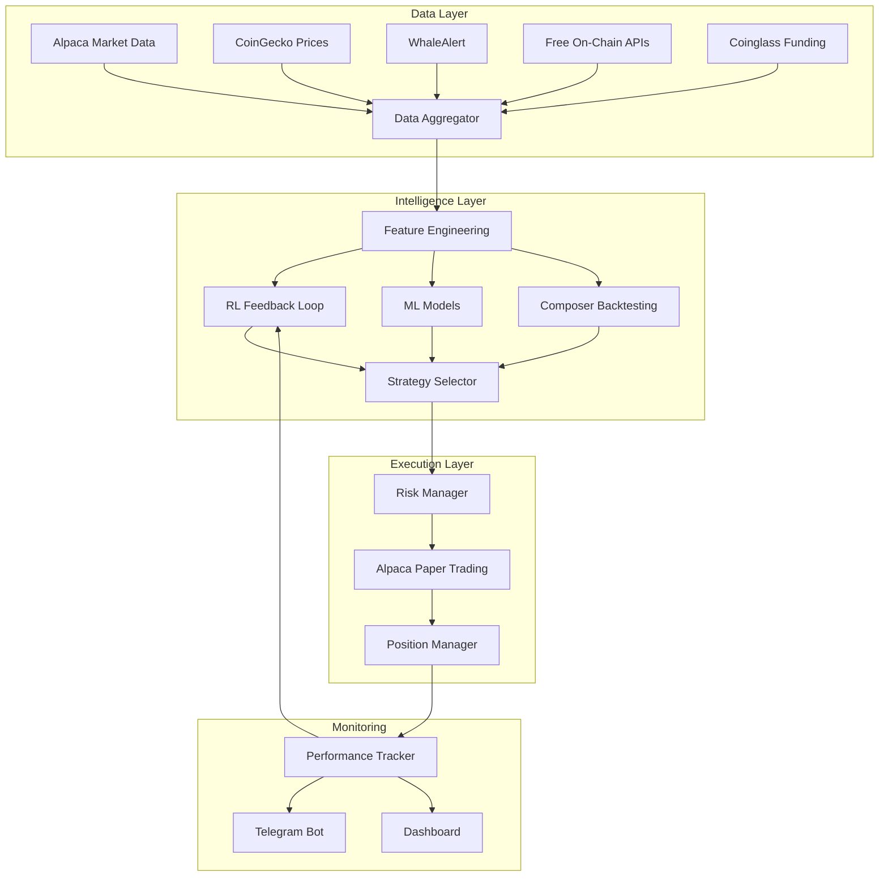

# Project Update - August 15, 2025

## 🔄 Critical Requirement Changes

### Exchange Strategy Update
- **PRIMARY:** Alpaca paper trading ONLY (immediate focus)
- **FUTURE:** Binance integration (keys available, but deferred)
- **REMOVED:** Kraken integration (DESCOPED from SOW)

### API Status
- **Awaiting:** Updated CoinGecko API key
- **Awaiting:** WhaleAlert API key
- **Available:** Binance keys (for future phase)
- **Confirmed:** Supabase backend access

## 📊 Strategic Decisions

### Composer MCP Integration (Hybrid Approach)
Use for:
- Backtesting infrastructure (saves 24h development)
- Performance monitoring
- Strategy validation
- Risk-reward analysis

### On-Chain Analytics Solutions (Free/Low-Cost)
1. **Etherscan API** - 5 calls/sec free tier
2. **Bitquery GraphQL** - Free tier for DEX/smart money
3. **Covalent API** - 100k credits/month free

### Funding Rates & Liquidation Data
1. **Coinglass API** - Free tier available
2. **Binance Public API** - No auth needed
3. **CryptoQuant** - Limited free access

## 🤖 Reinforcement Learning Architecture

### Core Components
```python
class TradingEnvironment:
    state_space = [
        'price', 'volume', 'rsi', 'macd',
        'sentiment', 'funding_rate', 'whale_activity'
    ]
    
    def reward_function(self, action, outcome):
        reward = (
            outcome.pnl * 1.0 +           # Raw profit
            outcome.sharpe * 0.3 +        # Risk-adjusted
            -max(0, outcome.drawdown - 0.10) * 5.0 +  # Penalty
            outcome.win_streak * 0.1      # Consistency
        )
        return reward
```

### RL Framework Options
- **Stable-Baselines3** - PyTorch RL (recommended)
- **Ray RLlib** - Scalable RL
- **TensorTrade** - Crypto-specific

## 🏗️ System Architecture



## 📋 Revised Priority List

### Week 1 (Immediate)
1. Optimize Alpaca integration (not Binance)
2. Integrate Composer MCP for backtesting
3. Set up free on-chain data sources

### Week 2 (Intelligence)
1. Implement basic RL framework
2. Build liquidity hunting with order book data
3. Create volume profile analysis

### Week 3 (Enhancement)
1. Add Telegram notifications
2. Implement advanced strategies
3. RL reward tuning

### Week 4 (Optimization)
1. Performance validation
2. RL model refinement
3. Production deployment

## 💡 Key Insights

### Cost Optimization
- Use free API tiers initially
- Upgrade only when hitting limits
- Leverage public endpoints (Binance funding rates)

### Development Efficiency
- Composer MCP saves ~40h on backtesting
- Start with simple RL, iterate quickly
- Use existing libraries vs building from scratch

### Risk Management
- Paper trading removes immediate capital risk
- Allows more aggressive RL experimentation
- Can perfect strategies before live deployment

## 🎯 Success Metrics (Updated)

### Phase 1 (Alpaca Paper Trading)
- Consistent positive returns in simulation
- Sharpe ratio >1.5
- Max drawdown <15%
- RL agent improvement over baseline

### Phase 2 (Future Binance)
- Sub-100ms execution
- 3-5% weekly returns
- Live capital deployment
- Full automation 24/7

---
*Updated: August 15, 2025*
*Status: Requirements refined, focus on Alpaca + RL*