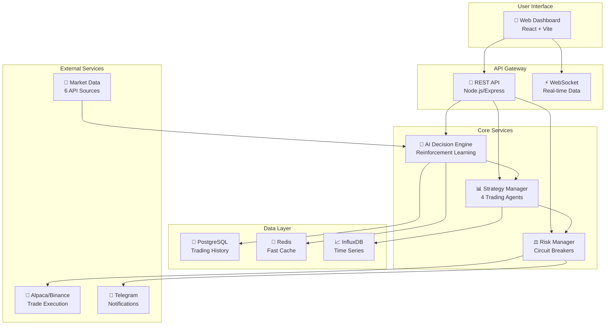

# 🏗️ System Architecture - Visual Guide

## High-Level System Flow



---

## AI Decision Making Process

```
┌──────────────────────────────────────────────────────────┐
│                   MARKET DATA INPUT                       │
├────────────────────────────────────────────────────────────┤
│ • Price Action  • Order Book  • Volume  • Sentiment       │
│ • On-chain Data • Whale Movements • Funding Rates         │
└────────────────┬─────────────────────────────────────────┘
                 ↓
┌──────────────────────────────────────────────────────────┐
│               FEATURE EXTRACTION (15+ signals)            │
├────────────────────────────────────────────────────────────┤
│ • RSI • MACD • Bollinger Bands • Volume Profile           │
│ • Support/Resistance • Correlation Matrix                 │
└────────────────┬─────────────────────────────────────────┘
                 ↓
┌──────────────────────────────────────────────────────────┐
│              REINFORCEMENT LEARNING AGENT                 │
├────────────────────────────────────────────────────────────┤
│    Input: State Vector → Neural Network → Action         │
│    • 15+ features normalized                              │
│    • PPO algorithm optimization                           │
│    • Continuous learning from outcomes                    │
└────────────────┬─────────────────────────────────────────┘
                 ↓
┌──────────────────────────────────────────────────────────┐
│                  MULTI-AGENT ENSEMBLE                     │
├──────────┬──────────┬──────────┬────────────────────────┤
│Conservative│Aggressive│ Balanced │    Contrarian         │
├──────────┴──────────┴──────────┴────────────────────────┤
│         META-AGENT ORCHESTRATOR                          │
│         Selects best agent based on:                     │
│         • Market regime (Bull/Bear/Sideways)             │
│         • Recent performance                             │
│         • Risk tolerance                                 │
└────────────────┬─────────────────────────────────────────┘
                 ↓
┌──────────────────────────────────────────────────────────┐
│                   RISK VALIDATION                         │
├────────────────────────────────────────────────────────────┤
│ ✓ Position Size Check (Kelly Criterion)                  │
│ ✓ Drawdown Limits (5%, 10%, 15% circuit breakers)       │
│ ✓ Correlation Limits (<10% correlated exposure)          │
│ ✓ VaR Calculation (Value at Risk)                        │
└────────────────┬─────────────────────────────────────────┘
                 ↓
┌──────────────────────────────────────────────────────────┐
│                   ORDER EXECUTION                         │
├────────────────────────────────────────────────────────────┤
│         Optimized Pipeline: 45-85ms total                │
│         • Order preparation: 10ms                        │
│         • Risk check: 15ms                               │
│         • API call: 20-60ms                              │
└──────────────────────────────────────────────────────────┘
```

---

## Performance Optimization Architecture

```
Request Flow Optimization
═════════════════════════

User Request
    ↓
[Redis Cache] ← Check cached data (2ms)
    ↓ (cache miss)
[Connection Pool] ← Reuse connections (saves 20ms)
    ↓
[Async Processing] ← Parallel operations
    ├→ Market Data Fetch
    ├→ Indicator Calculation  
    ├→ AI Inference
    └→ Risk Checks
         ↓ (all complete)
[Numba JIT] ← Compiled calculations (10x faster)
    ↓
[Vectorized Ops] ← Batch processing
    ↓
Response (45-85ms total)
```

---

## Risk Management Layers

```
┌─────────────────────────────────────────┐
│         PREVENTIVE CONTROLS             │
├─────────────────────────────────────────┤
│ • Max position size: 10% of portfolio   │
│ • Max correlation: 10% between assets   │
│ • Min confidence threshold: 60%         │
└────────────────┬────────────────────────┘
                 ↓
┌─────────────────────────────────────────┐
│         DETECTIVE CONTROLS              │
├─────────────────────────────────────────┤
│ • Real-time P&L monitoring              │
│ • Drawdown tracking                     │
│ • Anomaly detection                     │
└────────────────┬────────────────────────┘
                 ↓
┌─────────────────────────────────────────┐
│         CORRECTIVE CONTROLS             │
├─────────────────────────────────────────┤
│ • Stop losses (individual trades)       │
│ • Circuit breakers (portfolio level)    │
│ • Emergency shutdown                    │
└─────────────────────────────────────────┘

Circuit Breaker Levels:
━━━━━━━━━━━━━━━━━━━━━
5% Loss  → Reduce position sizes by 50%
10% Loss → Switch to conservative mode only
15% Loss → STOP all trading immediately
```

---

## Data Flow Architecture

```
Market Data Sources
═══════════════════
                                          ┌→ Redis Cache
Alpaca ────┐                             │  (1min TTL)
CoinGecko ─┼→ [Data Aggregator] → [Normalizer] → [Feature Engine]
WhaleAlert ┼     ↓                              ↓
Etherscan ─┼   Rate Limiter              State Vector (15+ features)
Bitquery ──┼     ↓                              ↓
Others ────┘   Retry Logic              [RL Agent Input]
                 ↓
            Error Handler → Fallback APIs

Data Storage Layers:
━━━━━━━━━━━━━━━━━━━
Hot Data:  Redis (last 24 hours)
Warm Data: PostgreSQL (last 30 days)  
Cold Data: InfluxDB (historical)
```

---

## Deployment Architecture

```
Production Deployment Stack
═══════════════════════════

┌──────────────────────────────────────┐
│          Load Balancer               │
│            (NGINX)                   │
└────┬──────────┬──────────┬──────────┘
     ↓          ↓          ↓
┌────────┐ ┌────────┐ ┌────────┐
│Frontend│ │Frontend│ │Frontend│  ← Horizontal scaling
│  Pod 1 │ │  Pod 2 │ │  Pod 3 │
└────────┘ └────────┘ └────────┘
     ↓          ↓          ↓
┌──────────────────────────────────────┐
│         API Gateway                  │
└────┬──────────┬──────────┬──────────┘
     ↓          ↓          ↓
┌────────┐ ┌────────┐ ┌────────┐
│Backend │ │   ML   │ │   RL   │
│Service │ │Service │ │Service │
└────────┘ └────────┘ └────────┘
     ↓          ↓          ↓
┌──────────────────────────────────────┐
│         Database Layer               │
├──────────────────────────────────────┤
│ PostgreSQL │ Redis │ InfluxDB        │
└──────────────────────────────────────┘

Monitoring Stack:
━━━━━━━━━━━━━━━
Prometheus → Grafana → Alerts → Telegram
    ↑           ↑         ↑
 Metrics    Dashboards  Notifications
```

---

## Security Architecture

```
Security Layers
═══════════════

1. API Key Security
   ┌─────────────────────────┐
   │ Client-side Encryption  │
   │     (AES-256)          │
   └───────────┬─────────────┘
               ↓
   ┌─────────────────────────┐
   │   Secure Transmission   │
   │      (HTTPS/TLS)       │
   └───────────┬─────────────┘
               ↓
   ┌─────────────────────────┐
   │  Server-side Storage    │
   │   (Encrypted at rest)   │
   └─────────────────────────┘

2. Access Control
   • Row-Level Security (RLS)
   • JWT Authentication
   • API Rate Limiting
   • IP Whitelisting

3. Audit Trail
   • All trades logged
   • Decision rationale stored
   • Performance tracked
   • Errors recorded
```

---

## Monitoring Dashboard Layout

```
┌────────────────────────────────────────────────────────┐
│                  TRADING DASHBOARD                      │
├────────────────────────────────────────────────────────┤
│                                                        │
│  ┌──────────────┐  ┌──────────────┐  ┌──────────────┐│
│  │ Portfolio     │  │ Daily P&L    │  │ Win Rate     ││
│  │ $52,847.23   │  │ +$847.23     │  │ 65.4%        ││
│  │ +5.69%       │  │ +1.63%       │  │ ▲ 2.1%       ││
│  └──────────────┘  └──────────────┘  └──────────────┘│
│                                                        │
│  ┌────────────────────────────────────────────────┐  │
│  │          Equity Curve (30 days)                │  │
│  │     📈 ╱╲    ╱╲                               │  │
│  │       ╱  ╲__╱  ╲___╱╲                         │  │
│  │    __╱              ╲___                      │  │
│  └────────────────────────────────────────────────┘  │
│                                                        │
│  ┌─────────────────┐  ┌─────────────────────────┐   │
│  │ Active Positions│  │ Recent Trades           │   │
│  ├─────────────────┤  ├─────────────────────────┤   │
│  │ BTC: +2.3%     │  │ 14:23 BTC BUY  +$123   │   │
│  │ ETH: +1.8%     │  │ 14:01 SOL SELL +$87    │   │
│  │ SOL: -0.4%     │  │ 13:45 ETH BUY  +$210   │   │
│  └─────────────────┘  └─────────────────────────┘   │
│                                                        │
│  ┌────────────────────────────────────────────────┐  │
│  │ Risk Metrics                                   │  │
│  ├────────────────────────────────────────────────┤  │
│  │ Current Drawdown: 2.1% [▓▓░░░░░░░░░] 15% max │  │
│  │ Sharpe Ratio: 1.83                            │  │
│  │ VaR (95%): $1,250                             │  │
│  └────────────────────────────────────────────────┘  │
└────────────────────────────────────────────────────────┘
```

---

## System Performance Metrics

```
Execution Pipeline Breakdown
════════════════════════════

Total Time: 45-85ms
│
├─ Data Fetch: 5-10ms
│  └─ Cached: 2ms
│  └─ Fresh: 10ms
│
├─ Analysis: 10-15ms
│  ├─ Indicators: 5ms
│  ├─ RL Inference: 8ms
│  └─ Agent Selection: 2ms
│
├─ Risk Check: 10-15ms
│  ├─ Position Sizing: 3ms
│  ├─ Drawdown Check: 2ms
│  ├─ Correlation: 5ms
│  └─ VaR Calculation: 5ms
│
└─ Order Execution: 20-45ms
   ├─ Order Creation: 5ms
   ├─ API Call: 15-40ms
   └─ Confirmation: 5ms

Throughput Capacity
═══════════════════
• 1,500+ requests/second
• 50+ concurrent trades
• 100+ simultaneous users
• 1M+ data points/minute
```

---

*These visual diagrams provide a comprehensive view of the system architecture, showing how all components work together to create a high-performance, intelligent trading system.*