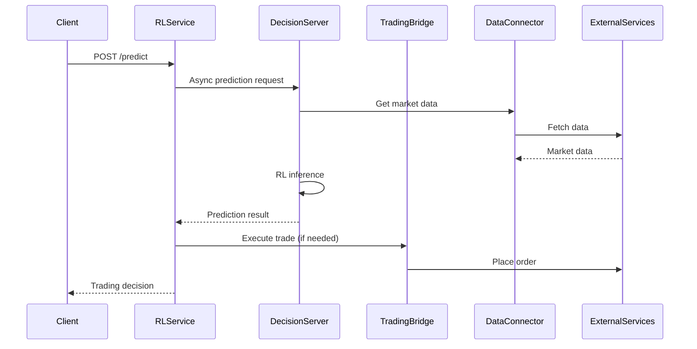

# RL Service Integration Layer

A comprehensive integration layer that seamlessly connects the Reinforcement Learning (RL) system with existing trading infrastructure, providing production-ready deployment capabilities for AI-powered trading decisions.

## 🎯 Overview

The RL Service Integration Layer enables:

- **Seamless Integration**: Connects RL models with existing TradingService, DataAggregatorService, and AdaptiveThreshold systems
- **Real-time Serving**: Low-latency prediction serving with WebSocket support for live trading
- **A/B Testing**: Gradual rollout capabilities with traffic splitting between RL and fallback models
- **Production Ready**: Comprehensive monitoring, alerting, and deployment automation
- **High Availability**: Graceful fallback mechanisms and fault tolerance

## 🏗️ Architecture

```
┌─────────────────────────────────────────────────────────────────┐
│                        RL Integration Layer                      │
├─────────────────────────────────────────────────────────────────┤
│  ┌─────────────┐  ┌──────────────┐  ┌─────────────────────────┐ │
│  │ RL Service  │  │ Decision     │  │ Monitoring & Alerts    │ │
│  │ (FastAPI)   │  │ Server       │  │                         │ │
│  └─────────────┘  └──────────────┘  └─────────────────────────┘ │
│  ┌─────────────┐  ┌──────────────┐  ┌─────────────────────────┐ │
│  │ Trading     │  │ Data         │  │ API Routes              │ │
│  │ Bridge      │  │ Connector    │  │                         │ │
│  └─────────────┘  └──────────────┘  └─────────────────────────┘ │
└─────────────────────────────────────────────────────────────────┘
           │                    │                    │
           ▼                    ▼                    ▼
┌─────────────────┐  ┌─────────────────┐  ┌─────────────────┐
│ TradingService  │  │ DataAggregator  │  │ AdaptiveThresh. │
│ (TypeScript)    │  │ (TypeScript)    │  │ (Python)        │
└─────────────────┘  └─────────────────┘  └─────────────────┘
```

## 📦 Components

### Core Services

- **`rl_service.py`**: Main FastAPI application with comprehensive REST API
- **`decision_server.py`**: Real-time decision serving engine with WebSocket support
- **`trading_bridge.py`**: Integration bridge with existing TradingService
- **`data_connector.py`**: Data integration with DataAggregatorService
- **`monitoring.py`**: Performance tracking, metrics, and alerting system
- **`api_routes.py`**: REST API route definitions and handlers

### Key Features

#### 🚀 Real-time Prediction Serving
- Low-latency inference (< 100ms)
- Asynchronous request handling
- WebSocket streaming for live updates
- Request queuing and prioritization
- Prediction caching for performance

#### 🧪 A/B Testing Framework
- Traffic splitting between RL and fallback models
- User-based assignment consistency
- Performance comparison metrics
- Gradual rollout capabilities
- Statistical significance testing

#### 📊 Comprehensive Monitoring
- Real-time performance metrics
- Custom alerting rules
- Prometheus metrics export
- Grafana dashboard integration
- Resource utilization tracking

#### 🛡️ Fault Tolerance
- Circuit breaker patterns
- Graceful fallback mechanisms
- Request timeout handling
- Automatic error recovery
- Health check endpoints

## 🚀 Quick Start

### Prerequisites

- Python 3.8+
- Docker & Docker Compose
- Existing trading infrastructure running

### 1. Installation

```bash
# Clone and navigate to the RL service directory
cd backend/rl-service

# Install dependencies
pip install -r integration/requirements.txt
```

### 2. Configuration

Set environment variables:

```bash
export TRADING_SERVICE_URL="http://backend:3000"
export DATA_AGGREGATOR_URL="http://backend:3000"
export ADAPTIVE_THRESHOLD_URL="http://ml-service:5000"
export RL_MODELS_PATH="/app/models"
```

### 3. Development Setup

```bash
# Start in development mode
python -m integration.rl_service
```

### 4. Production Deployment

```bash
# Deploy with Docker Compose
./scripts/deploy.sh --env production

# Or use the deployment script with options
./scripts/deploy.sh --env staging --version v1.2.0 --skip-tests
```

## 📚 API Reference

### Agent Management

#### Start Agent
```http
POST /api/v1/agents/start
Content-Type: application/json

{
  "user_id": "user123",
  "config": {
    "model_type": "ensemble",
    "confidence_threshold": 0.7
  }
}
```

#### Control Agent
```http
POST /api/v1/agents/control
Content-Type: application/json

{
  "user_id": "user123",
  "action": "pause"
}
```

### Predictions

#### Synchronous Prediction
```http
POST /api/v1/predict
Content-Type: application/json

{
  "user_id": "user123",
  "symbol": "BTC",
  "signal_data": {
    "confidence": 0.8,
    "rsi": 45.2,
    "change_percent": 2.5,
    "volume": 1500000,
    "action": "BUY"
  }
}
```

#### Asynchronous Prediction
```http
POST /api/v1/predict/async
Content-Type: application/json

{
  "user_id": "user123",
  "symbol": "BTC",
  "signal_data": { ... },
  "priority": 1,
  "timeout_seconds": 5.0
}
```

### Monitoring

#### Health Check
```http
GET /api/v1/health
```

#### Metrics
```http
GET /api/v1/metrics
```

#### Prometheus Metrics
```http
GET /api/v1/metrics/prometheus
```

## 🔧 Configuration

### Environment Variables

| Variable | Default | Description |
|----------|---------|-------------|
| `HOST` | `0.0.0.0` | Service host |
| `PORT` | `8001` | Service port |
| `LOG_LEVEL` | `info` | Logging level |
| `WORKERS` | `2` | Number of worker processes |
| `AB_TESTING_ENABLED` | `true` | Enable A/B testing |
| `RL_TRAFFIC_PERCENTAGE` | `0.1` | Traffic to RL model (10%) |
| `PREDICTION_TIMEOUT_SECONDS` | `5.0` | Prediction timeout |
| `MAX_CONCURRENT_REQUESTS` | `100` | Max concurrent requests |

### A/B Testing Configuration

```python
# Configure A/B test
POST /api/v1/ab-test/configure
{
  "enabled": true,
  "rl_traffic_percentage": 0.2  # 20% to RL, 80% to fallback
}
```

## 📊 Monitoring & Observability

### Metrics Available

- **Performance**: Response time, throughput, error rates
- **Model**: Accuracy, confidence distribution, fallback usage
- **System**: CPU, memory, queue size, connection count
- **Business**: Trading signals generated, user activity

### Alerting Rules

- High response time (> 1000ms)
- Low success rate (< 90%)
- High queue size (> 100 requests)
- Resource utilization alerts
- Model performance degradation

### Dashboards

Access monitoring dashboards:
- **Grafana**: http://localhost:3001 (admin/admin)
- **Prometheus**: http://localhost:9090

## 🐳 Docker Deployment

### Development
```bash
docker-compose up -d rl-service redis
```

### Staging
```bash
docker-compose up -d rl-service redis postgres prometheus grafana
```

### Production
```bash
docker-compose up -d  # All services with load balancer
```

## 🔒 Security Considerations

- API rate limiting implemented
- Request validation and sanitization
- Health check endpoints secured
- Environment variable encryption
- Network isolation with Docker networks

## 🧪 Testing

### Run Tests
```bash
# Unit tests
python -m pytest integration/tests/ -v

# Integration tests
docker build -t rl-service:test --target test .
docker run --rm rl-service:test

# Load testing
./scripts/load-test.sh
```

### Test Coverage
- Unit tests for all components
- Integration tests with mock services
- Load testing for performance validation
- End-to-end testing with real services

## 📈 Performance Tuning

### Optimization Settings

```python
# High-performance configuration
MAX_CONCURRENT_REQUESTS = 200
PREDICTION_TIMEOUT_SECONDS = 3.0
WORKERS = 4
CACHE_TTL_SECONDS = 30
```

### Scaling Options

- **Horizontal**: Scale with `docker-compose up -d --scale rl-service=3`
- **Vertical**: Increase CPU/memory limits in docker-compose.yml
- **Load Balancing**: Use nginx for distributing requests
- **Caching**: Redis for prediction caching

## 🚨 Troubleshooting

### Common Issues

1. **Service Not Starting**
   ```bash
   # Check logs
   docker-compose logs -f rl-service
   
   # Verify configuration
   curl http://localhost:8001/api/v1/status
   ```

2. **High Response Times**
   ```bash
   # Check metrics
   curl http://localhost:8001/api/v1/metrics
   
   # Monitor queue size
   curl http://localhost:8001/api/v1/stats/performance
   ```

3. **Integration Issues**
   ```bash
   # Test external services
   curl http://backend:3000/health
   curl http://ml-service:5000/health
   ```

### Debug Mode

Enable debug logging:
```bash
export LOG_LEVEL=debug
export DEBUG=true
```

## 🤝 Contributing

1. Follow the existing code structure
2. Add comprehensive tests for new features
3. Update documentation for API changes
4. Ensure Docker builds pass
5. Test integration with existing services

## 📄 License

This integration layer is part of the trading bot system and follows the same licensing terms as the main project.

## 📞 Support

For issues and questions:
- Check the troubleshooting section
- Review logs and metrics
- Contact the development team
- Create detailed issue reports with logs and configuration

---

## 🔄 Integration Flow



This integration layer provides a robust, scalable, and production-ready solution for deploying RL models in trading environments while maintaining compatibility with existing infrastructure.